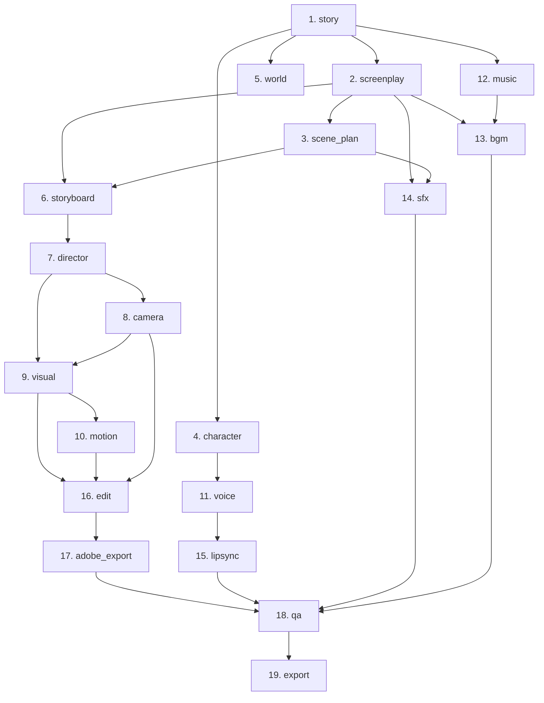

# Product Requirements Document (PRD): ANANTA Multi-Agent Production Engine

**Document Status:** Canonical Single Source of Truth  
**Current Milestone Baseline:** Milestone 10.5 (`eab14a6`)  
**Target Repository:** `ANANTA_MULTI_AGENT_ENGINE`  

---

## 1. Product Vision and Objectives

### 1.1 Vision
The **ANANTA Multi-Agent Production Engine** is a local-first, deterministic, concurrent multi-agent orchestration framework designed to transform structured episode creative briefs into fully realized, production-ready pre-production and post-production creative deliverables across a 19-stage media pipeline.

### 1.2 Core Objectives
* **Local-First & Resilient:** Execute completely offline using local mock providers or local LLM runtimes (e.g., Ollama), with deterministic execution, circuit breakers, and bounded retry recovery.
* **Deterministic DAG Data-Flow:** Execute multi-stage pipelines respecting topological dependencies, enabling parallel branch execution while strictly preserving immutable parent-to-child data flow.
* **Rigorous Validation & Self-Correction:** Guarantee that every stage produces structured JSON conforming to strict schemas before data is passed downstream or written to disk, with self-correcting prompt feedback on retry.
* **Crash-Safe Persistence & Artifact Integrity:** Ensure atomic writes, SHA-256 checksummed versioned artifact lineages, and crash-resilient checkpointing for safe pause/resume workflows.

---

## 2. Scope and Non-Goals

### 2.1 In Scope
* **19-Stage Pipeline Architecture:** Standardized input/output contracts, dependencies, and execution across all 19 defined pre-production, visual, audio, editing, and packaging stages.
* **Dual Execution Modes:**
  * Sequential Pipeline Orchestration (`pipeline.orchestrator_v2`)
  * Concurrent DAG Pipeline Orchestration (`pipeline.concurrent_orchestrator`) with cooperative worker cancellation.
* **Provider Abstraction & Routing:** Unified provider interfaces supporting `MockProviderV2` and `OllamaProviderV2`, dynamic Jinja2 prompt rendering, and configurable model routing.
* **Validation & Retry Framework:** Schema validation per stage, bounded exponential backoff with jitter, stage-scoped circuit breaking, and dynamic validation feedback injection.
* **Persistence & Recovery:** JSON State Store, Checkpoint Manager, atomic file I/O, artifact indexing, and crash recovery.

### 2.2 Non-Goals
* **Direct Binary Media Rendering:** The engine is an orchestration scaffold producing structured scene data, timelines (FCPXML), cue sheets, markers (CSV), and prompt deliverables; it does not natively render raw MP4 video or 3D graphics (as documented in `shared/PRODUCTION_STATUS.md`).
* **Cloud / Distributed Database Infrastructure:** The engine is designed as a local-first system; distributed cluster schedulers, cloud-hosted message brokers, and multi-tenant web portals are strictly out of scope.
* **Unbounded Retries or Uncontrolled Hallucination:** Agents must not loop indefinitely on failure or silently replace invalid outputs with mock data during real execution.

---

## 3. The 19-Stage Production Pipeline

The engine defines a canonical 19-stage Directed Acyclic Graph (DAG):

### Stage Specifications Summary

| # | Stage Name | Dependencies | Primary Inputs | Key Produced Outputs |
|---|---|---|---|---|
| **1** | `story` | None | `episode_id`, `title` | `synopsis`, `themes`, `acts`, `beats` |
| **2** | `screenplay` | `story` | `synopsis` | `scenes`, `total_pages` |
| **3** | `scene_plan` | `screenplay` | `scenes` | `breakdown` (shots, camera setups, VFX notes) |
| **4** | `character` | `story` | `characters` | `profiles` (arcs, key moments) |
| **5** | `world` | `story` | `locations` | `rules`, `technology`, `society` |
| **6** | `storyboard` | `screenplay`, `scene_plan` | `scenes`, `breakdown` | `panels`, `key_frames`, `aspect_ratio` |
| **7** | `director` | `storyboard` | `panels`, `key_frames` | `vision`, `shot_style`, `pacing`, `continuity_notes` |
| **8** | `camera` | `director` | `vision`, `shot_style` | `lenses`, `movement`, `lighting` |
| **9** | `visual` | `director`, `camera` | `vision`, `lenses` | `concept_art`, `vfx_breakdown`, `color_palette` |
| **10** | `motion` | `visual` | `concept_art`, `vfx_breakdown` | `animation_style`, `key_sequences`, `frame_rate` |
| **11** | `voice` | `character` | `characters`, `profiles` | `casting`, `direction`, `recording_notes` |
| **12** | `music` | `story` | `themes`, `synopsis` | `themes`, `cues`, `style`, `instrumentation` |
| **13** | `bgm` | `music`, `screenplay` | `themes`, `scenes` | `tracks`, `ducking_points`, `transitions` |
| **14** | `sfx` | `screenplay`, `scene_plan` | `scenes`, `breakdown` | `design`, `spot_effects`, `ambience` |
| **15** | `lipsync` | `voice` | `characters`, `casting` | `phoneme_maps`, `viseme_schedule`, `quality_checks` |
| **16** | `edit` | `visual`, `motion`, `camera` | `concept_art`, `animation_style`, `lenses` | `assembly`, `pacing_notes`, `transitions`, `music_sync` |
| **17** | `adobe_export` | `edit` | `assembly`, `transitions` | `timeline_xml`, `markers_csv`, `media_bins`, `readme` |
| **18** | `qa` | `adobe_export`, `lipsync`, `sfx`, `bgm` | All parent outputs | `checks_passed`, `issues`, `approval` |
| **19** | `export` | `qa` | `approval` | `deliverables`, `specs`, `package` |

---

## 4. Architecture & Agent Contracts

### 4.1 Handoff Contract Invariant
Per `shared/AGENT_CONTRACT.md`, every stage output payload committed to the engine must contain:
1. `episode_id`: Standardized episode identifier (e.g. `ANANTA-S01E01`).
2. `stage`: Target stage name.
3. `version`: Monotonically increasing version number (integer $\ge 1$).
4. `generated_at`: ISO 8601 UTC timestamp.
5. `inputs`: Sanitized snapshot of upstream input parameters and merged outputs.
6. `outputs`: Stage-specific structured output matching the stage JSON schema.
7. `assumptions`: Array of assumptions made during processing.
8. `warnings`: Array of non-fatal warnings encountered.
9. `approval_status`: Current validation/approval state (`pending`, `approved`, `rejected`).

**Immutability Rule:** No agent may mutate or silently alter locked story foundations, character identities, location constraints, dialogue meaning, or audio language.

---

## 5. Provider Integration & Validation

### 5.1 Provider Architecture
* **`BaseProviderV2`**: Core abstraction with synchronous execution, standard error mapping, timeout management, latency metrics recording, and structured responses (`ProviderResponse`).
* **`MockProviderV2`**: Deterministic provider with seed support and simulated latency, producing 100% schema-compliant outputs for all 19 stages.
* **`OllamaProviderV2`**: Local LLM provider executing multi-stage Jinja2 prompts (`prompts/*.j2`) against models (e.g. `llama3.1`), with automatic Markdown JSON extraction (`extract_json_payload`).
* **`ModelRouter` / `ProviderRegistry`**: Dynamic stage-to-provider routing configured via YAML / environment variables.

### 5.2 Schema Validation & Feedback Retries
* **Strict Validation (`StageValidator`)**: Each stage validates outputs against dedicated JSON schemas.
* **`SchemaValidationError`**: Subclasses `(RetryableError, ValueError)` so invalid schema outputs trigger bounded retries instead of aborting immediately.
* **Dynamic Feedback Loop (`ValidationFeedback`)**: On validation failure, error details are captured, structured, and injected into the prompt context for subsequent retry attempts (`validation_feedback_text`), allowing the LLM to self-correct.

---

## 6. Orchestration, Retries, Persistence & Recovery

### 6.1 Orchestrator Implementations
* **`PipelineOrchestratorV2`**: Sequential DAG executor supporting checkpointing, stage hydration, and pause/resume.
* **`ConcurrentPipelineOrchestrator`**: High-concurrency DAG engine utilizing `StageScheduler`, `PipelineExecutor`, and thread-pool workers with thread-safe state synchronization and cooperative cancellation tokens.

### 6.2 Retry & Circuit Breaker Policies
* **Bounded Retries**: Configured via `RetryPolicy` (max attempts, base delay, exponential backoff, jitter cap).
* **Circuit Breakers**: Stage-scoped breakers open after consecutive failures to isolate downstream pipeline branches from cascading failures.

### 6.3 Artifact & Persistence Integrity
* **Atomic I/O**: `atomic_write_text()` ensures zero half-written files via temporary file staging and atomic renaming.
* **`ArtifactManager`**: Versioned artifact storage in `outputs/artifacts/{episode_id}/`, maintaining SHA-256 checksums and an indexed JSON registry (`index.json`).
* **Downstream Failure Isolation**: A failed stage marks downstream dependents as `BLOCKED`, guaranteeing invalid or unvalidated data is never passed to child stages.

---

## 7. Current Implementation Status & Verified Milestones

| Milestone | Baseline Commit | Focus Area | Status |
| :--- | :--- | :--- | :--- |
| **M1–M7** | Baseline | Foundation, Scheduler, Executor, Providers V1 | **COMPLETE & LOCKED** |
| **M8** | `6d0b4a6` | Crash-safe Persistence, Recovery & Artifact Checksums | **COMPLETE & LOCKED** |
| **M9** | `6a65491` | Concurrent DAG Data-Flow Engine | **COMPLETE & LOCKED** |
| **M10.1** | `210ccd5` | Multi-Stage Prompt Templates (19 Stages) & Provider Routing | **COMPLETE & LOCKED** |
| **M10.2** | `4031b10` | Stage Output Schemas (19 Stages), JSON Extraction & Validation | **COMPLETE & LOCKED** |
| **M10.3** | `863fd0b` | Bounded Validation Retry Integration & Downstream Isolation | **COMPLETE & LOCKED** |
| **M10.4** | `2efc05e` | End-to-End 19-Stage Sequential & Concurrent Pipeline CLI | **COMPLETE & LOCKED** |
| **M10.5** | `eab14a6` | Dynamic Validation-Feedback Loop (Self-Correcting Retries) | **COMPLETE & LOCKED** |

*Test Status as of M10.5:* **515 passed, 1 skipped**; 0 lint errors (`ruff check .`), 0 whitespace diff issues (`git diff --check`).

---

## 8. Confirmed Gaps & Technical Risks

1. **Live Ollama Health Check & Dynamic Failover (Risk: Medium):**
   `OllamaProviderV2` connects directly via HTTP. If the local Ollama daemon is offline or a configured model is missing, execution raises `ProviderUnavailableError`. There is currently no pre-flight health-probe with automatic graceful fallback to mock providers.
2. **Execution Telemetry & Graph Lineage Export (Risk: Low):**
   Logs contain detailed execution context, but there is no standardized machine-readable summary file (e.g. `_pipeline_telemetry.json`) capturing full token usage, latency trees, and DAG hash lineage in a single export.
3. **Outdated Architectural Limitations Documentation (Risk: Low):**
   `docs/PHASE2_ARCHITECTURE.md` lists limitations (such as lack of parallel execution and output validation) that have now been implemented by M9 and M10.1–M10.5.

---

## 9. M10.6 Scope Proposals *(Proposed & Not Approved)*

> [!IMPORTANT]
> The following proposals are candidates for Milestone 10.6. Neither is approved or selected. Awaiting explicit user direction.

### Proposal A: Live Ollama Pre-Flight Health Checks & Automatic Provider Fallback
* **Objective:** Implement pre-flight health probes for `OllamaProviderV2` and automatic fallback to `MockProviderV2` when Ollama is unreachable.
* **Target Files:** `providers/base_v2.py`, `providers/registry_v2.py`, `config_v2.py`, `tests/test_m10_6_ollama_health_and_fallback.py`.

### Proposal B: Pipeline Telemetry & End-to-End Artifact Lineage Export
* **Objective:** Emit a unified `_pipeline_telemetry.json` and artifact lineage tree per episode run with per-stage token/latency metrics.
* **Target Files:** `pipeline/artifacts.py`, `observability/logging.py`, `pipeline/orchestrator_v2.py`, `pipeline/concurrent_orchestrator.py`.

### Proposal C: M10 Documentation Refresh, Edge-Case Stress Validation & Milestone Final Lock
* **Objective:** Update documentation to reflect completed M9/M10 architecture, execute non-ASCII and extreme-duration stress suites, and lock Milestone 10.
* **Target Files:** `docs/PHASE2_ARCHITECTURE.md`, `README.md`, `tests/test_m10_6_milestone_lock_and_stress.py`.

---

## 10. Future Roadmap

* **Milestone 11 (M11):** External Media Provider Integration Adapters (e.g., ComfyUI / Automatic1111 for image gen, ElevenLabs / Coqui for voice synthesis, Suno / MusicGen for BGM).
* **Milestone 12 (M12):** Interactive Human-in-the-Loop (HITL) Review & Approval Gates (pausing DAG at designated stages for human operator review).
* **Milestone 13 (M13):** Timeline Assembly & Video Packaging Exporters (generating conformable NLE project bundles and preview manifests).

---

## 11. Open Decisions & Change-Control Process

### 11.1 Open Decisions
1. **M10.6 Scope Selection:** Awaiting stakeholder decision on Proposal A, B, C, or custom scope.
2. **Default Fallback Behavior:** Whether provider routing should automatically fallback to mock mode in production CLI runs when real model services are offline, or fail fast.

### 11.2 Change-Control Process
* **Protected Baseline Invariant:** `pipeline/providers.py` is strictly protected and must never be modified.
* **Test-Driven Development (TDD):** Every future change must begin with RED unit/integration tests before production implementation.
* **Full Regression Verification:** All commits must pass 100% of existing regression tests with zero linter or whitespace errors.
* **Documentation Synchronization:** Any modification to pipeline stages, schemas, or provider contracts must be updated in `PRD.md` upon lock.
