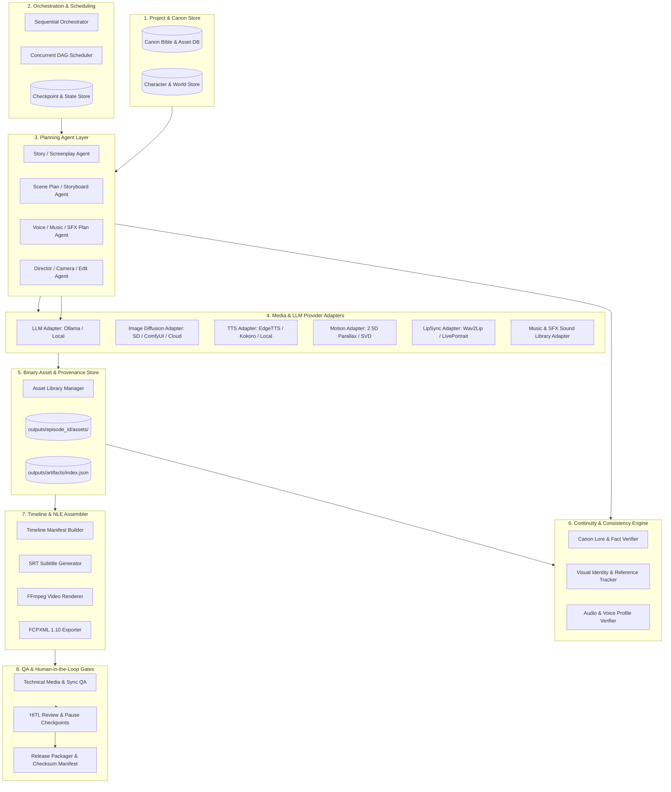

# Architecture Proposal
## Target Production Architecture for the ANANTA Anime Production Engine

**Document Version:** 1.0.0  
**Source Specification:** `ANANTA_Master_Product_Requirements_Specification.md` (Sections 5, 8, 11, 15, 18)  
**Target Codebase:** `ANANTA_MULTI_AGENT_ENGINE`  

---

### 1. Architectural Blueprint

The ANANTA Engine is structured as a **modular, local-first, multi-agent media production system**. It cleanly decouples high-level creative planning from low-level binary media generation, asset storage, cross-stage continuity validation, and final NLE timeline assembly.



---

### 2. Specification of the 10 Decoupled Subsystems

#### Subsystem 1: Project & Canon Bible Store
* **Purpose:** Canonical repository for immutable project lore, character profiles, world rules, timeline chronology, and knowledge graphs.
* **Key Contracts:**
  * `get_canon_facts(query: str) -> list[CanonFact]`
  * `get_character_profile(character_id: str) -> CharacterProfile`
  * `validate_canon_compliance(text: str) -> list[CanonViolation]`

#### Subsystem 2: Orchestration & Scheduling Engine
* **Purpose:** Coordinates the execution of the 19 stages respecting topological DAG dependencies, concurrency locks, circuit breaking, and crash recovery.
* **Implementations:** `PipelineOrchestratorV2` (sequential execution), `ConcurrentPipelineOrchestrator` (parallel thread pool with cooperative cancellation tokens).

#### Subsystem 3: Agent & Structured Planning Layer
* **Purpose:** Transforms project inputs into structured JSON production plans using Jinja2 prompt templates with self-correcting validation feedback loops on retry.
* **Output Standard:** Every stage produces a standardized envelope containing `episode_id`, `stage`, `version`, `inputs`, `outputs`, `assumptions`, `warnings`, and `approval_status`.

#### Subsystem 4: Media Provider Adapter Layer
* **Purpose:** Isolates external AI models and media generators behind uniform provider interfaces.
* **Base Contract:** `BaseMediaProvider`
  ```python
  class BaseMediaProvider(ABC):
      @abstractmethod
      def check_health(self) -> ProviderHealthReport: ...
      @abstractmethod
      def estimate_resources(self, request: MediaRequest) -> ResourceEstimate: ...
      @abstractmethod
      def generate_media(self, request: MediaRequest) -> MediaResult: ...
  ```

#### Subsystem 5: Asset Library & Provenance Manager
* **Purpose:** Indexes, versions, deduplicates, and validates SHA-256 hashes of all binary media files, keeping large binary bytes strictly separate from JSON DAG state.
* **Directory Contract:** `outputs/{episode_id}/assets/{asset_type}/{asset_id}_v{version}.{ext}`

#### Subsystem 6: Cross-Stage Continuity Engine
* **Purpose:** Deterministic verifier running across planning, generation, and QA stages to ensure:
  1. No lore contradiction (e.g. power progression remains Spark $\rightarrow$ Resonance $\rightarrow$ Epic State).
  2. Character knowledge boundaries (characters do not act on unacquired knowledge).
  3. Visual reference adherence (fixed traits, clothing damage continuity, Ronit ~150 cm height).
  4. Audio identity consistency (stable voice profile IDs).

#### Subsystem 7: Timeline Assembler & Video Renderer
* **Purpose:** Compiles verified visual assets, dialogue audio stems, background music tracks, and subtitle data into a single cohesive timeline.
* **Implementations:**
  * `TimelineAssembler`: Manages `TimelineManifest`, generates `.srt` subtitles, constructs FFmpeg concat scripts, and renders H.264/AAC MP4 video files.
  * `AdobePremiereBridge`: Generates valid FCPXML 1.10 interchange files linking absolute media file paths.

#### Subsystem 8: QA & Technical Verification Engine
* **Purpose:** Performs automated validation on rendered media:
  * FFprobe decodability and duration consistency.
  * Dialogue/subtitle sync timing check.
  * Audio loudness normalization (ITU-R BS.1770 / EBU R128).
  * Video frame-drop and black-frame detection.

#### Subsystem 9: Human-in-the-Loop (HITL) Review Engine
* **Purpose:** Pauses DAG execution at user-configured review gates (Screenplay, Storyboard, Voice Takes, Rough Cut, Final QA), allowing human inspection, revision annotation, and selective downstream branch regeneration.

#### Subsystem 10: Observability, Telemetry & Resource Manager
* **Purpose:** Provides structured logging, correlation IDs, execution latency trees, GPU VRAM tracking, and automated generation of `_pipeline_telemetry.json`.

---

### 3. Media Provenance & Labeling Standard

Every generated artifact and media file must carry an explicit origin tag:

```json
{
  "asset_id": "ast_maya_voice_001",
  "origin_type": "real_generated",
  "provenance": {
    "provider_name": "EdgeTTSProvider",
    "provider_type": "tts",
    "voice_id": "en-US-JennyNeural",
    "model_version": "v1.2",
    "is_mock": false,
    "is_fallback": false,
    "is_placeholder": false,
    "generated_at": "2026-09-25T13:00:00Z",
    "source_line_id": "ep001_SCENE_01_000",
    "sha256": "e3b0c44298fc1c149afbf4c8996fb92427ae41e4649b934ca495991b7852b855"
  }
}
```

* **`mock`**: Deterministic synthetic test output (e.g. standard library WAV).
* **`placeholder`**: Labeled geometric/text stand-in graphic (e.g. BMP placeholder).
* **`synthetic`**: Provider-generated media not yet human-approved.
* **`real_generated`**: Output generated from an active AI media model.
* **`user_supplied`**: User-uploaded approved production assets.
* **`approved`**: Formally reviewed and signed off by the human operator.

---

### 4. Episode Output Directory Hierarchy

```
outputs/{episode_id}/
├── prototype_episode.mp4          # Master rendered MP4 video
├── subtitles.srt                  # Timecode-aligned SubRip subtitles
├── timeline_manifest.json         # Complete NLE timeline manifest
├── timeline_concat.txt            # FFmpeg demuxer script
├── _pipeline_telemetry.json       # Run telemetry, metrics, and lineage
├── voice/                         # Generated speech dialogue audio files
│   ├── {episode_id}_{scene}_{seq}_{speaker}.wav
│   └── ...
├── visuals/                       # Keyframes, background art, character visuals
│   ├── {episode_id}_{scene}_{shot}.png
│   └── ...
├── placeholders/                  # Labeled BMP/PNG placeholder stand-ins
│   ├── {episode_id}_{scene}_{shot}.bmp
│   └── ...
├── audio_stems/                   # Stems: dialogue.wav, bgm.wav, sfx.wav, mix.wav
├── fcpxml/                        # Adobe Premiere / Final Cut Pro interchange
│   └── {episode_id}_timeline.xml
└── artifacts/                     # Versioned JSON stage output payloads
    ├── index.json                 # SHA-256 artifact catalog
    ├── story_v1.json
    ├── story_v1.meta.json
    └── ...
```
