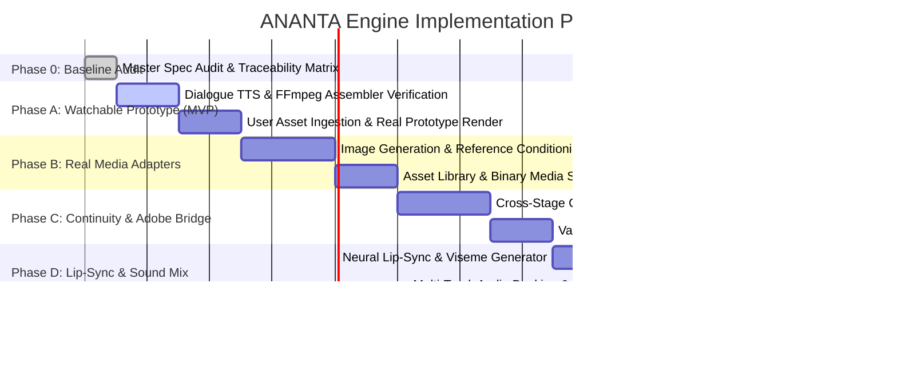

# Implementation Roadmap
## Phased Implementation Plan for the Complete ANANTA Anime Production Engine

**Document Version:** 1.0.0  
**Source Specification:** `ANANTA_Master_Product_Requirements_Specification.md` (Sections 19, 20, 21)  
**Target Codebase:** `ANANTA_MULTI_AGENT_ENGINE`  

---

### Roadmap Overview

---

### Phase 0: Master Specification Audit & Architectural Baseline *(Completed)*

* **Objective:** Establish canonical traceability between `ANANTA_Master_Product_Requirements_Specification.md` and the existing codebase, identify all architectural/functional gaps, and construct the implementation roadmap.
* **Requirements Covered:** `REQ-ARCH-01`, `REQ-ARCH-04`, `REQ-PERSIST-01`, `REQ-SEC-01`.
* **Deliverables:** Complete audit suite in `docs/master_spec_audit/`.

---

### Phase A: Minimum Complete Episode Vertical Slice (MVP Prototype)

* **Objective:** Deliver the first watchable, end-to-end video prototype from an approved script to a playable 30–60 second MP4 video file combining user-supplied/placeholder images, real spoken TTS dialogue, background music, and timed subtitles.
* **Requirements Covered:**
  * `REQ-VIS-01`, `REQ-VIS-03`, `REQ-ORIGIN-01`, `REQ-ORIGIN-04`, `REQ-AUDIO-01`, `REQ-AUDIO-02`, `REQ-TIMELINE-01`, `REQ-TIMELINE-02`, `REQ-TIMELINE-03`, `REQ-PROTO-01` through `REQ-PROTO-05`.
* **Files to Create / Modify:**
  * `pipeline/timeline_assembler.py` (Enhance with user-image ingestion & Ken Burns pan/zoom filter).
  * `pipeline/user_asset_ingest.py` (Create: Validates and organizes user-supplied images/audio).
  * `pipeline/episode_packager.py` (Create: Bundles MP4, SRT, timeline JSON, and checksum manifest).
  * `tests/test_phase_a_prototype_e2e.py` (Create: Full pipeline integration test from screenplay to MP4).
* **Dependencies:** Host FFmpeg binary (installed via `winget install Gyan.FFmpeg`).
* **Implementation Sequence:**
  1. Verify host FFmpeg installation.
  2. Implement user asset ingestion component (`UserAssetIngest`) to load approved character and background artwork.
  3. Wire `VoiceAgentV2` to synthesize speech dialogue using `EdgeTTS` or `Kokoro`.
  4. Build `TimelineManifest` linking user visual assets, speech WAV files, BGM audio, and SRT subtitles.
  5. Execute `TimelineAssembler.render()` to generate `outputs/{episode_id}/prototype_episode.mp4`.
  6. Generate release package manifest and summary report.
* **Risks & Regressions:**
  * FFmpeg path misconfiguration on Windows.
  * Audio/video duration drift causing subtitle de-synchronization.
* **Acceptance Criteria:**
  * Playable 1280×720 H.264/AAC MP4 generated in `outputs/{episode_id}/`.
  * Timed subtitles aligned within $\pm 100$ ms of dialogue speech.
  * All prototype assets truthfully labeled in `RenderResult` metadata.

---

### Phase B: Real Media Generation Adapters & Asset Library

* **Objective:** Transition from user-supplied/placeholder media to AI-generated anime assets while maintaining strict character visual consistency and a centralized binary asset management system.
* **Requirements Covered:**
  * `REQ-CANON-04`, `REQ-CANON-05`, `REQ-ASSET-01` through `REQ-ASSET-05`, `REQ-VISUAL-01`, `REQ-AUDIO-03`, `REQ-AUDIO-04`, `REQ-HW-01`.
* **Files to Create / Modify:**
  * `providers/media_base.py` (Create: `BaseMediaProvider` interface).
  * `providers/image_provider.py` (Create: Image diffusion adapter supporting ComfyUI / SD / Cloud API with ControlNet/IP-Adapter conditioning).
  * `pipeline/asset_library.py` (Create: Binary asset indexer, thumbnailer, and deduplicator).
  * `providers/audio_catalog.py` (Create: BGM/SFX sound library indexer).
  * `tests/test_phase_b_image_provider.py`, `tests/test_phase_b_asset_library.py`.
* **Dependencies:** Local ComfyUI / SD-WebUI instance or configured Cloud API key (Replicate / RunPod).
* **Implementation Sequence:**
  1. Create `BaseMediaProvider` abstract contract.
  2. Build `AssetLibrary` managing binary file hashing, metadata indexing, and reverse-reference lookups.
  3. Implement `ImageDiffusionProvider` with reference conditioning (using approved turnaround sheets for Rudra, Aadhya, Ronit, Ira).
  4. Connect `VisualAgentV2` to generate keyframe images for storyboard panels.
  5. Implement `AudioCatalogProvider` to index and search BGM/SFX library stems.
* **Risks & Regressions:**
  * GPU VRAM exhaustion (exceeding 6 GB VRAM ceiling) if Ollama and Diffusion run concurrently.
  * Character visual drift across shots.
* **Acceptance Criteria:**
  * Generated PNG keyframe images saved in `outputs/{episode_id}/visuals/`.
  * Character visual identity preserved across multiple camera angles.
  * VRAM usage strictly managed under 6 GB via sequential unloading.

---

### Phase C: Cross-Stage Continuity Engine, HITL Review & Adobe Bridge

* **Objective:** Establish automated cross-stage continuity verification, interactive human review gates, and validated Adobe Premiere Pro interchange.
* **Requirements Covered:**
  * `REQ-CANON-02`, `REQ-CANON-08`, `REQ-CONT-01` through `REQ-CONT-06`, `REQ-HITL-01`, `REQ-DEP-01`, `REQ-TIMELINE-04`.
* **Files to Create / Modify:**
  * `pipeline/continuity_engine.py` (Create: Canon lore, character state, visual, and audio validator).
  * `pipeline/hitl_manager.py` (Create: Pause/resume checkpoint coordinator and review CLI).
  * `pipeline/adobe_bridge.py` (Create: FCPXML 1.10 export generator with absolute media file URIs).
  * `tests/test_phase_c_continuity.py`, `tests/test_phase_c_adobe_bridge.py`.
* **Dependencies:** Adobe Premiere Pro (for manual FCPXML import smoke testing).
* **Implementation Sequence:**
  1. Implement `ContinuityEngine` with rule-based checks for canon lore, power progressions, character knowledge, and visual outfit state.
  2. Integrate continuity checks into `QAAgentV2` and generate formal `ContinuityReport`.
  3. Implement `HITLManager` allowing pipeline to pause at designated gates, accept user annotations, and selectively invalidate downstream DAG nodes.
  4. Implement `AdobePremiereBridge` producing fully conformable FCPXML 1.10 project files.
* **Risks & Regressions:**
  * False positive continuity rejections halting automated runs.
  * Path formatting incompatibilities between Windows backslashes and FCPXML URIs (`file://localhost/...`).
* **Acceptance Criteria:**
  * Continuity engine detects and blocks forbidden power terms (e.g. "Avatar State").
  * Pipeline pauses at configured review gates and resumes seamlessly upon approval.
  * Generated FCPXML imports into Adobe Premiere Pro without media-offline errors.

---

### Phase D: Lip-Sync, Advanced Motion & Multi-Track Audio Mixing

* **Objective:** Animate characters with synchronized dialogue lip movements, implement 2.5D parallax camera motion, and deliver broadcast-quality multi-track audio mixing with automatic BGM ducking.
* **Requirements Covered:**
  * `REQ-AUDIO-05`, `REQ-VISUAL-02`, `REQ-STG-10`, `REQ-STG-15`, `REQ-QA-01`.
* **Files to Create / Modify:**
  * `providers/lipsync_provider.py` (Create: Neural audio-to-viseme adapter using Wav2Lip / LivePortrait).
  * `pipeline/motion_engine.py` (Create: 2.5D parallax and pan/zoom interpolation engine).
  * `pipeline/audio_mixer.py` (Create: FFmpeg sidechain compressor for dynamic BGM ducking and stem export).
  * `tests/test_phase_d_lipsync.py`, `tests/test_phase_d_audio_mix.py`.
* **Dependencies:** Lip-sync model weights or cloud API; FFmpeg with `sidechaincompress` filter.
* **Implementation Sequence:**
  1. Build `LipSyncProvider` to synchronize speech audio WAV with character face crops.
  2. Implement `MotionEngine` to generate 2.5D camera movements across visual keyframes.
  3. Implement `AudioMixer` to apply dynamic ducking curves (reducing BGM volume during spoken dialogue).
  4. Update `TimelineAssembler` to assemble animated video clips and multi-track audio stems (`dialogue.wav`, `bgm.wav`, `sfx.wav`, `master.wav`).
* **Risks & Regressions:**
  * Video generation latency and VRAM limits.
  * Unnatural lip-sync warping artifacts.
* **Acceptance Criteria:**
  * Spoken phonemes align with character mouth movements.
  * Background music ducks automatically during dialogue segments.
  * Stems exported separately alongside master MP4 render.

---

### Phase E: Scalable Production, Multi-Episode Queuing & Telemetry

* **Objective:** Enable multi-episode batch scheduling, real-time telemetry dashboards, compute resource/cost monitors, and automated master release packaging.
* **Requirements Covered:**
  * `REQ-VIS-02`, `REQ-PERSIST-01`, `REQ-SEC-01` through `REQ-SEC-03`, `REQ-STG-19`.
* **Files to Create / Modify:**
  * `pipeline/batch_runner.py` (Create: Multi-episode queue coordinator).
  * `observability/telemetry_exporter.py` (Create: Generates `_pipeline_telemetry.json` with token/latency metrics).
  * `pipeline/release_packager.py` (Create: Distribution packager with SHA-256 manifest and README).
  * `tests/test_phase_e_batch_and_telemetry.py`.
* **Implementation Sequence:**
  1. Build `BatchRunner` with configurable concurrency limits and episode priority queues.
  2. Implement `TelemetryExporter` to capture full execution traces, model latency, and token consumption.
  3. Build `ReleasePackager` to create standardized archive bundles containing video deliverables, subtitles, project files, and verification checksums.
* **Acceptance Criteria:**
  * Batch processing of multiple episodes without cross-contamination.
  * Complete `_pipeline_telemetry.json` emitted for every episode run.
  * Release archive verified with 100% SHA-256 checksum agreement.
